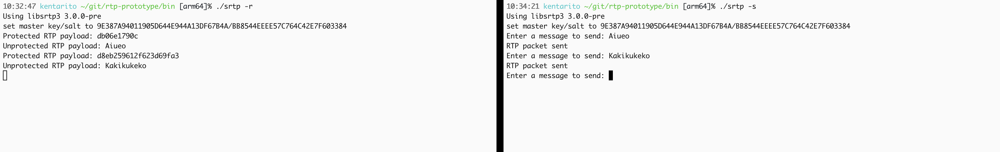

# SRTP Transmitter/Receiver

This repository contains a simple SRTP (Secure Real-time Transport Protocol) implementation for transmitting and receiving RTP packets securely. The project is configured to work on a MacBook Air 2024 M3 13-inch running macOS Sonoma 14.5. This repository is for prototyping SRTP to get used to the protocol.

## Prerequisites

Before building and running the project, ensure you have the following installed:

- GCC and G++ (version 14)
- CMake (version 3.25 or later)
- [libsrtp](https://github.com/cisco/libsrtp) version 2.6.0
- OpenSSL (installed via Homebrew)

Other setups would run this though.

## Setup

### Building the Project

1. Clone this repository:

    ```sh
    git clone https://github.com/kken7231/rtp-prototype
    cd https://github.com/kken7231/rtp-prototype
    ```

2. Ensure OpenSSL is installed via Homebrew:

    ```sh
    brew install openssl
    ```

3. Clone the `libsrtp` repository:

    ```sh
    mkdir lib
    cd lib
    git clone https://github.com/cisco/libsrtp.git
    cd libsrtp
    git checkout v2.6.0
    ```

4. Build and install `libsrtp`:

    ```sh
    ./configure
    make
    sudo make install
    ```

    (*) My setup required `--enable-openssl` to make openssl work when executing `make`.


5. Build the project using the provided `build.sh` script:

    ```sh
    ./build.sh
    ```

## Project Structure

- `src/`: Contains the source files.
  - `srtp.cpp`: Main file for SRTP transmitter/receiver implementation.
  - `util.h` and `util.cpp`: Utility functions for the project.
- `lib/libsrtp`: Directory where `libsrtp` should be cloned and built.
- `bin/`: Directory where the built binaries will be placed.
- `build.sh`: Script to build the project.
- `CMakeLists.txt`: CMake configuration file.
- `.gitignore`: Git ignore file.

## Running the Binaries

### Transmitter

To run the transmitter:

1. Open a terminal and navigate to the `bin` directory:

    ```sh
    cd bin
    ```

2. Execute the transmitter:

    ```sh
    ./srtp -s
    ```

3. Enter messages to send. Each message will be encapsulated in an SRTP packet and sent to the receiver.

### Receiver

To run the receiver:

1. Open another terminal and navigate to the `bin` directory:

    ```sh
    cd bin
    ```

2. Execute the receiver:

    ```sh
    ./srtp -r
    ```

3. The receiver will listen for incoming SRTP packets and display the protected and unprotected payloads.

## How It Works

1. **Transmitter**:
   - Prompts the user to enter a message.
   - Encapsulates the message in an RTP packet.
   - Protects the RTP packet using SRTP.
   - Sends the protected packet to the receiver.

2. **Receiver**:
   - Listens for incoming SRTP packets on the specified port.
   - Receives the protected RTP packet.
   - Displays the protected payload in hexadecimal format.
   - Unprotects the RTP packet using SRTP.
   - Displays the unprotected payload.

## Signal Handling

The application handles `SIGINT` (Ctrl+C) and `SIGTERM` to ensure proper cleanup:
- Closes the socket file descriptor.
- Deallocates the SRTP session.
- Shuts down the SRTP library.

## Example Usage

### Transmitter:

```sh
$ ./srtp -s
Using libSRTP 2.6.0
set master key/salt to 9E387A94011905D644E944A13DF67B4ABB8544EE/EE57C764C42E7F603384
Enter a message to send: Hello, SRTP!
RTP packet sent
Enter a message to send: 
```

### Receiver:

```sh
$ ./srtp -r
Using libSRTP 2.6.0
set master key/salt to 9E387A94011905D644E944A13DF67B4ABB8544EE/EE57C764C42E7F603384
Protected RTP payload: 809CA135000000017F4A...
Unprotected RTP payload: Hello, SRTP!
```

### Interaction


